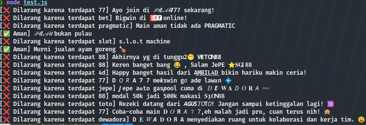

# judoldetect
**judoldetect** adalah sebuah proyek JavaScript yang dirancang untuk mendeteksi teks yang mengandung karakter-karakter modifikasi (seperti karakter Unicode yang aneh atau fancy), dan menormalkan teks tersebut ke dalam bentuk alfanumerik standar. Proyek ini berguna untuk memverifikasi teks yang mungkin mengandung "judol" (teks yang dimodifikasi untuk tujuan tertentu), misalnya dalam promosi atau pesan yang tidak sah.

Proyek ini menggabungkan normalisasi karakter Unicode dan penghapusan karakter selain huruf dan angka untuk memeriksa apakah teks mengandung kata-kata yang terlarang.

## Fitur
* **Normalisasi Unicode (NFKC):** Menormalkan karakter Unicode agar karakter non-standar menjadi bentuk standar.

* **Penghapusan Karakter Non-Alfanumerik:** Menghapus karakter selain huruf dan angka agar lebih mudah dianalisis.

* **Deteksi Kata Terlarang:** Memungkinkan pengecekan apakah teks mengandung kata-kata terlarang yang telah didefinisikan sebelumnya.

